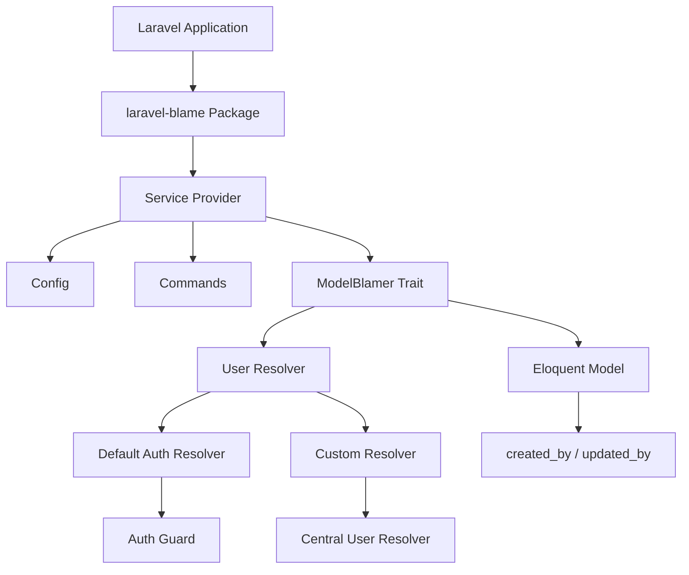
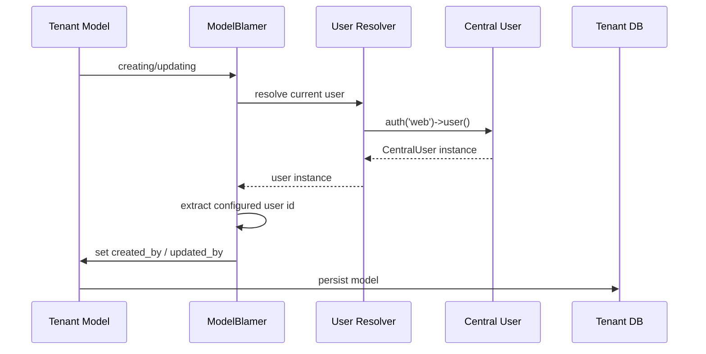
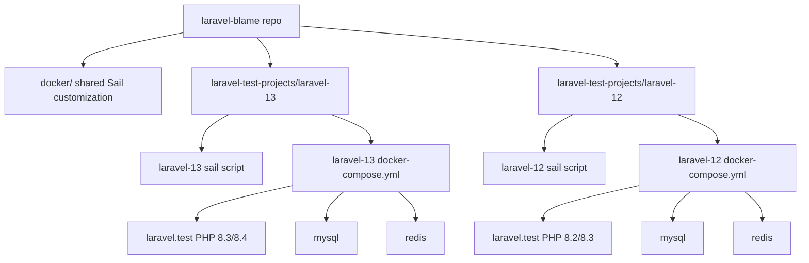

# Laravel Blame: Laravel 12/13 Modernization, Multi-Tenancy, and Dockerized Test Projects Research

## Executive Summary

`laravel-blame` is a Laravel package that automates population of `created_by` and `updated_by` columns on Eloquent models. The current implementation is small and functional for simple Laravel applications, but it is not yet ready for modern Laravel 12/13 package development practices, robust multi-version testing, or DB-per-tenant SaaS architectures where users live in a central landlord database while tenant models live in separate tenant databases.

The recommended modernization path is:

1. **Keep the core behavior unchanged**: the package should still automatically fill `created_by` and `updated_by` fields during model create/update events.
2. **Modernize dependencies and CI** for Laravel 12 and 13, PHP 8.2+, and current testing tooling.
3. **Add a user resolver abstraction** so applications can resolve users from a different database connection than the model being saved.
4. **Make system user fallback configurable** and connection-agnostic.
5. **Create a Sail-based Dockerized multi-project test workspace** under `laravel-test-projects/` with at least a Laravel 13 Sail test app and a shared `docker/` setup at the repository root.
6. **Expand tests** to cover model blaming, system user behavior, commands, config resolution, and multi-tenant central-user scenarios.

## 1. Current Package Analysis

### 1.1 Package Purpose

From `README.md`, `laravel-blame` provides:

- Automatic population of `created_by` and `updated_by` fields on Eloquent models.
- A `ModelBlamer` trait that hooks into Eloquent `creating` and `updating` events.
- A system user command for cases where no authenticated user exists.
- A migration generator command for adding blame fields to existing tables.
- A facade and service provider for package registration.

### 1.2 Current Structure

```text
src/
  Commands/
    BlameFieldsMigrationCommand.php
    SystemUserCommand.php
  Contracts/
    HandleEnvFile.php
    ModelBlame.php
  Database/Migrations/
    BlameMigrationCreator.php
  Facades/
    LaravelBlame.php
  Traits/
    EnvFileHandler.php
    ModelBlamer.php
    UserModelForAuth.php
  LaravelBlame.php
  LaravelBlameServiceProvider.php
config/
  blame.php
  private_blame.php
tests/
  ExampleTest.php
  TestCase.php
```

### 1.3 Current Compatibility

The current `composer.json` declares:

```json
{
  "php": "^8.2",
  "illuminate/contracts": "^9.0|^10.0|^11.0|^12.0",
  "spatie/laravel-package-tools": "^1.19.0",
  "orchestra/testbench": "^7.0|^8.0|^9.0|^10.0",
  "pestphp/pest": "^1.21|^2.0|^3.0",
  "phpunit/phpunit": "^9.5|^10.0|^11.0"
}
```

The current CI matrix only tests:

- PHP 8.2
- Laravel 9.x
- `orchestra/testbench` 7.x

This means the package is **not currently validated against Laravel 12 or 13**.

### 1.4 Current Behavior

The package currently:

1. Uses `Auth::check()` and `Auth::user()->getKey()` to determine the current user.
2. Falls back to `config('blame.system_user_id')` when no user is authenticated.
3. Assumes the user model lives on the same database connection as the model being saved.
4. Provides `creator()` and `updater()` Eloquent relationships using the configured auth user model.
5. Creates system users and writes `BLAME_SYSTEM_USER_ID` to `.env`.

### 1.5 Current Risks

The current implementation has several risks for modern Laravel and multi-tenant usage:

- **Laravel 13 compatibility is unverified** because CI does not test Laravel 12 or 13.
- **User resolution is tightly coupled to the default auth guard**.
- **The package assumes the user model is on the same database connection as the blamed model**, which breaks DB-per-tenant architectures with central users.
- **System user fallback is not tenant-aware**.
- **Tests are minimal** and do not cover the main package behavior.
- **No Sail-based multi-project test workspace exists** for end-to-end validation across Laravel versions.

## 2. Laravel 13 Package Development Research

### 2.1 Laravel 13 Key Requirements

Laravel 13 requires:

- PHP 8.2 or higher.
- `laravel/framework` 13.x.
- `orchestra/testbench` 11.x or compatible.
- `pestphp/pest` 4.x if using Pest.
- `phpunit/phpunit` 12.x if using PHPUnit.

### 2.2 Laravel Package Development Best Practices

According to Laravel 13 package development documentation:

- Packages should use **package discovery** via `composer.json`.
- Service providers should use `mergeConfigFrom()` for configuration.
- Configuration files should be published to the application’s `config/` directory.
- Commands should be registered via the service provider.
- Migrations should be published via `publishesMigrations()`.
- Views should be registered via `loadViewsFrom()`.
- Packages should avoid closures in config files when config caching is used.
- Packages should be tested with **Orchestra Testbench** to simulate a real Laravel application.

### 2.3 Laravel 13 Upgrade Notes Relevant to This Package

The Laravel 13 upgrade guide includes several changes that may affect this package:

- **Request Forgery Protection**: `VerifyCsrfToken` is deprecated in favor of `PreventRequestForgery`.
- **Eloquent Model Booting**: Creating new model instances during model booting is disallowed.
- **Cache Prefixes and Session Cookie Names**: default naming changed.
- **Container::call and Nullable Class Defaults**: behavior changed for nullable class defaults.
- **PHP 8.5 Polyfill**: global helper conflicts may occur with legacy helper packages.

For `laravel-blame`, the most relevant change is the Eloquent booting behavior. The current package does not instantiate models during booting, so this is likely safe, but it should still be tested.

### 2.4 Laravel 13 Package Tooling

The package currently uses `spatie/laravel-package-tools`. For Laravel 13 support, the package should use a version that explicitly supports Laravel 13. The changelog for `spatie/laravel-package-tools` notes a release adding Laravel 13 support and dropping old versions.

## 3. Multi-Tenancy and Central Users Research

### 3.1 Architecture Context

The user wants the package to work in a **DB-per-tenant SaaS** architecture where:

- Users live in a **central landlord database**.
- Business data lives in **tenant-specific databases**.
- The package should store the central user’s primary key in the tenant model’s `created_by` and `updated_by` fields.

This is a common multi-tenancy pattern supported by libraries like **Tenancy for Laravel** and **Spatie multitenancy**.

### 3.2 Core Design Principle

The package should be **database-connection-agnostic**. It should:

- Resolve a user scalar ID.
- Write that ID into the model fields.
- Never assume the user and model share the same database connection.
- Never enforce Eloquent relationships across connections inside the package.

### 3.3 Recommended Multi-Tenancy Design

The package should expose a configurable user resolver abstraction.

#### Option A: Closure-based resolver

```php
'user_resolver' => fn () => auth('web')->user(),
```

#### Option B: Class-based resolver

```php
'user_resolver' => App\Resolvers\CentralUserResolver::class,
```

The resolver should return a user model or scalar ID. The package should then extract the configured ID attribute.

### 3.4 Recommended Config Changes

The package should support:

```php
return [
    'user_resolver' => fn () => auth()->user(),
    'user_id_attribute' => 'id',
    'system_user_id' => null,
    'system_user_name' => env('BLAME_SYSTEM_USER_NAME', 'system'),
    'system_user_email' => env('BLAME_SYSTEM_USER_EMAIL', 'system@example.test'),
    'created_by_field_name' => 'created_by',
    'updated_by_field_name' => 'updated_by',
];
```

### 3.5 Multi-Tenancy Example

A tenant model should be able to use the package like this:

```php
class Article extends Model
{
    use ModelBlamer;

    protected $connection = 'tenant';
}
```

The central user model should live on the landlord connection:

```php
class CentralUser extends Authenticatable
{
    protected $connection = 'landlord';
}
```

The config should resolve the central user:

```php
'user_resolver' => fn () => auth('web')->user(),
'user_id_attribute' => 'id',
```

The package should only write the scalar user ID into `created_by` and `updated_by`. It should not attempt to create cross-connection Eloquent relationships.

## 4. Docker and Test Project Strategy

### 4.1 Example Project Research Result

The referenced `example-laravel-project-with-dockerized-dev-env` was not available in the local workspace and was not reachable through public web search during this pass. Because the user specifically requested a Laravel-way setup using Sail, this document now treats Laravel Sail as the primary development model and documents the expected Sail workflow that the example should follow.

### 4.2 Laravel Sail Reference Architecture

Laravel Sail is the official Laravel Docker development environment. A Sail-based project normally contains:

```text
project/
  composer.json
  artisan
  docker-compose.yml or compose.yaml
  sail
  vendor/bin/sail
  .env
  .env.example
  docker/              # only when Sail config is published/customized
    php/
      Dockerfile
      php.ini
      supervisord.conf
```

The core Sail contract is:

- `composer.json` includes `laravel/sail` as a dev dependency.
- `docker-compose.yml` or `compose.yaml` is generated by `php artisan sail:install`.
- The main application service is named `laravel.test`.
- The `sail` script delegates to `vendor/bin/sail`, which delegates to Docker Compose.
- Commands are run through Sail so they execute inside the container.

### 4.3 Required Sail Command Coverage

The test projects must support the same command style as a normal Laravel Sail application.

#### Environment Commands

```bash
sail up
sail up -d
sail down
sail down -v
sail ps
sail logs
sail shell
sail root-shell
sail build --no-cache
```

#### Composer Commands

```bash
sail composer install
sail composer update
sail composer require laravel/sail --dev
sail composer require ../laravel-blame
```

#### Artisan Commands

```bash
sail artisan migrate
sail artisan migrate:fresh
sail artisan migrate:fresh --seed
sail artisan optimize:clear
sail artisan test
sail artisan package:discover
sail artisan blame:set:systemuser
sail artisan blame:make:migration users
```

#### Node / Frontend Commands

```bash
sail npm install
sail npm run dev
sail npm run build
```

#### Package Test Commands

```bash
sail composer test
sail composer test-coverage
sail composer analyse
sail composer format
```

### 4.4 Recommended Repository Structure

The repository should contain a folder such as:

```text
laravel-test-projects/
  laravel-13/
    app/
    bootstrap/
    config/
    database/
    composer.json
    docker-compose.yml or compose.yaml
    sail
    .env.example
    tests/
  laravel-12/
    ...
  laravel-11/
    ...
```

At the repository root, there should be a `docker/` folder similar to the example Dockerized dev environment. This folder should provide shared Sail customization and orchestration assets, not replace Sail inside each test project.

### 4.5 Recommended Docker Approach

For a package repository with multiple test apps, the best approach is:

1. Use **Laravel Sail** inside each test project.
2. Use a shared `docker/` folder at the repository root for reusable Sail customization, helper scripts, and orchestration documentation.
3. Keep each test project independently runnable with its own `sail` script and `docker-compose.yml` / `compose.yaml`.
4. Use separate Docker Compose project names or ports to avoid conflicts when running multiple Laravel versions in parallel.
5. Mount the package repository into each test project via bind mounts so local changes are reflected immediately.
6. Prefer path dependencies for the package under development:

```json
{
  "repositories": [
    {
      "type": "path",
      "url": "../../",
      "options": {
        "symlink": true
      }
    }
  ],
  "require": {
    "kamansoft/laravel-blame": "*@dev"
  }
}
```

### 4.6 Why Dockerized Sail Test Projects Matter

Dockerized Sail test projects provide:

- Reproducible environments.
- Version isolation.
- Easier CI/CD parity.
- Ability to test multiple Laravel versions in parallel.
- No local PHP version dependency for contributors.
- Commands that match real Laravel application workflows.
- A realistic environment for package discovery, Artisan commands, migrations, and Eloquent behavior.

### 4.7 Recommended Sail Services

Each test project should have the standard Sail services:

- `laravel.test` service for the Laravel app.
- `mysql` or `mariadb` service for the database.
- `redis` service if cache/session/queue behavior needs testing.
- `mailpit` service if email-related system user behavior needs testing.
- `selenium` service if browser-level end-to-end tests are added later.

For this package, MySQL or MariaDB is likely sufficient for the first phase because the package is primarily model-event and migration focused.

### 4.8 Sail Environment Variables

Each Sail test project should expose the usual Laravel environment variables:

```env
APP_PORT=8000
WWWUSER=1000
WWWGROUP=1000
DB_CONNECTION=mysql
DB_HOST=mysql
DB_PORT=3306
DB_DATABASE=laravel
DB_USERNAME=sail
DB_PASSWORD=password
MAIL_MAILER=log
```

When multiple test projects run at the same time, each project should override the host-facing ports:

```env
# laravel-test-projects/laravel-13/.env
APP_PORT=8013
FORWARD_DB_PORT=3313

# laravel-test-projects/laravel-12/.env
APP_PORT=8012
FORWARD_DB_PORT=3312
```

## 5. Testing Strategy

### 5.1 Current Test Gap

The current test suite only has a trivial test:

```php
it('can test', function () {
    expect(true)->toBeTrue();
});
```

This is not sufficient for a package that manipulates Eloquent model events, commands, and configuration.

### 5.2 Required Test Coverage

The package should have tests for:

#### Unit Tests

- `ModelBlamer::blameOnCreate()`
- `ModelBlamer::blameOnUpdate()`
- `ModelBlamer::getUserToBlamePk()`
- System user fallback behavior
- User resolver abstraction
- Config field names

#### Integration Tests

- Full Eloquent create/update flow with a real model.
- Command execution for `blame:set:systemuser`.
- Command execution for `blame:make:migration`.
- Config publishing and merging.
- Package discovery.

#### Multi-Tenancy Tests

- Central user model on landlord connection.
- Tenant model on tenant connection.
- User resolver returns a central user while tenant model is on tenant connection.
- System user fallback remains tenant-aware.

### 5.3 Testbench Matrix

The test matrix should include:

- PHP 8.2, 8.3, 8.4
- Laravel 12.x, 13.x
- `orchestra/testbench` matching each Laravel version
- `pestphp/pest` and `phpunit/phpunit` compatible with each Laravel version

## 6. Proposed Architecture

### 6.1 Package Architecture



### 6.2 Multi-Tenancy Flow



### 6.3 Sail-Based Test Workspace



## 7. Requirements

### 7.1 Functional Requirements

1. The package must continue to populate `created_by` and `updated_by` automatically.
2. The package must support Laravel 13.
3. The package must support Laravel 12.
4. The package must preserve existing Laravel 9–11 behavior where possible.
5. The package must support custom user resolvers.
6. The package must support central users in a landlord database.
7. The package must support tenant models on separate database connections.
8. The package must preserve system user fallback behavior.
9. The package must support configurable user ID attributes.
10. The package must remain connection-agnostic.

### 7.2 Non-Functional Requirements

1. The package must be tested against a Dockerized Laravel 13 project.
2. The package must be tested against a Dockerized Laravel 12 project.
3. The package must have better test coverage than the current trivial test.
4. The package must follow Laravel package development best practices.
5. The package must remain easy to install and configure.
6. The package must not force a specific multi-tenancy library.

### 7.3 Development Environment Requirements

1. A `docker/` folder must exist at the repository root for shared Sail customization and helper assets.
2. A `laravel-test-projects/` folder must exist at the repository root.
3. At least one Laravel 13 Sail test project must exist.
4. Each Sail test project must include its own `sail` script and `docker-compose.yml` / `compose.yaml`.
5. The test projects must be able to use the local package code through a Composer path dependency.
6. The Docker setup must allow running all standard Sail commands inside containers.
7. The Docker setup must support `sail artisan`, `sail composer`, `sail npm`, `sail test`, and `sail shell`.
8. The Docker setup must be documented.

## 8. Implementation Roadmap

### Phase 1: Research and Planning

- [x] Read current README and source code.
- [x] Research Laravel 13 package development docs.
- [x] Research Laravel 13 upgrade guide.
- [x] Research Laravel Sail and Docker best practices.
- [x] Research multi-tenancy central-user patterns.
- [x] Create this research and requirements document.

### Phase 2: Package Modernization

- [ ] Update `composer.json` constraints.
- [ ] Update service provider to follow Laravel 13 package docs.
- [ ] Add user resolver abstraction.
- [ ] Add user ID attribute config.
- [ ] Make system user fallback configurable.
- [ ] Ensure no same-connection assumptions remain.
- [ ] Update README and CHANGELOG.

### Phase 3: Testing Expansion

- [ ] Add unit tests for model blaming.
- [ ] Add integration tests for Eloquent create/update.
- [ ] Add command tests.
- [ ] Add multi-tenancy tests.
- [ ] Add config tests.
- [ ] Add Sail-based end-to-end tests using the test projects.

### Phase 4: Sail-Based Test Workspace

- [ ] Create `docker/` folder at repo root for shared Sail customization and helper assets.
- [ ] Create `laravel-test-projects/laravel-13/` as a real Sail application.
- [ ] Add `sail` script and `docker-compose.yml` / `compose.yaml` to the Laravel 13 test project.
- [ ] Configure the Laravel 13 test project to depend on the local package via Composer path dependency.
- [ ] Add a Laravel 12 Sail test project when the support matrix is confirmed.
- [ ] Add documentation for running standard Sail commands and package tests.

### Phase 5: CI/CD Update

- [ ] Update GitHub Actions matrix for Laravel 12 and 13.
- [ ] Add PHP 8.2, 8.3, 8.4 matrix.
- [ ] Add Sail-based test project job.
- [ ] Add coverage reporting.
- [ ] Add code style enforcement.

## 9. Acceptance Criteria

The work is complete when:

1. The package installs and works in a Laravel 13 application.
2. The package installs and works in a Laravel 12 application.
3. The package still works in Laravel 9–11 where supported.
4. The package supports central users in a landlord database.
5. The package supports tenant models in separate tenant databases.
6. The package has meaningful test coverage for the core behavior.
7. The package has a Sail-based test workspace.
8. The package has documentation explaining Laravel 13 and multi-tenancy usage.
9. CI runs the package tests across the supported matrix.
10. The package follows Laravel package development best practices.
11. Each test project can be started, stopped, tested, and inspected with standard Laravel Sail commands.

## 10. References

- Laravel 13 Installation: https://laravel.com/docs/13.x
- Laravel 13 Package Development: https://laravel.com/docs/13.x/packages
- Laravel 13 Upgrade Guide: https://laravel.com/docs/13.x/upgrade
- Laravel Sail: https://laravel.com/docs/13.x/sail
- Laravel Sail Starter: https://github.com/zeyadrezk/laravel-sail-starter
- Laravel Versions: https://laravelversions.com/en
- Spatie Laravel Package Tools: https://github.com/spatie/laravel-package-tools
- Tenancy for Laravel: https://tenancyforlaravel.com
- Multi-tenancy in Laravel: https://dev.to/zoran_bogoevski_78d62459b/implementing-multi-tenancy-in-laravel-a-comprehensive-guide-3735
- Packagist: https://packagist.org/packages/kamansoft/laravel-blame

## 11. Appendix: Current File Inventory

### 11.1 Main Source Files

- `src/LaravelBlameServiceProvider.php`
- `src/Traits/ModelBlamer.php`
- `src/Traits/UserModelForAuth.php`
- `src/Traits/EnvFileHandler.php`
- `src/Commands/SystemUserCommand.php`
- `src/Commands/BlameFieldsMigrationCommand.php`
- `src/Database/Migrations/BlameMigrationCreator.php`
- `src/Facades/LaravelBlame.php`
- `src/Contracts/ModelBlame.php`
- `src/Contracts/HandleEnvFile.php`

### 11.2 Config Files

- `config/blame.php`
- `config/private_blame.php`

### 11.3 Tests

- `tests/TestCase.php`
- `tests/ExampleTest.php`

### 11.4 CI Workflows

- `.github/workflows/run-tests.yml`
- `.github/workflows/phpstan.yml`

## 12. Appendix: Current README Summary

The README describes the package as a tool for managing `created_by` and `updated_by` fields in Laravel Eloquent models. It explains:

- Installation via Composer.
- Required auth provider configuration.
- Usage of the `ModelBlamer` trait.
- The `blame:make:migration` command.
- The `blame:set:systemuser` command.
- The purpose of the system user fallback.

## 13. Appendix: Current Known Issues

1. `BlameMigrationCreator::getstub()` has a lowercase method name that should be `getStub()`.
2. `BlameFieldsMigrationCommand::checkIfTableExits()` has a typo in the method name.
3. `SystemUserCommand::createNewSystemUserUser()` has a redundant word in the method name.
4. `EnvFileHandler::setEnvValue()` has typo `Atempt`.
5. The package currently uses `env()` directly in config, which is not ideal for config caching.
6. The package does not support custom user resolvers.
7. The package does not support central users in a different database connection.
8. The package has minimal test coverage.
9. The package is not validated against Laravel 12 or 13.

## 14. Appendix: Recommended Next Steps After This Document

1. Create the Dockerized test workspace.
2. Create the Laravel 13 test project.
3. Update `composer.json`.
4. Update the service provider.
5. Add user resolver abstraction.
6. Add user ID attribute config.
7. Expand tests.
8. Update README and CHANGELOG.
9. Update CI.
10. Tag a new release.

